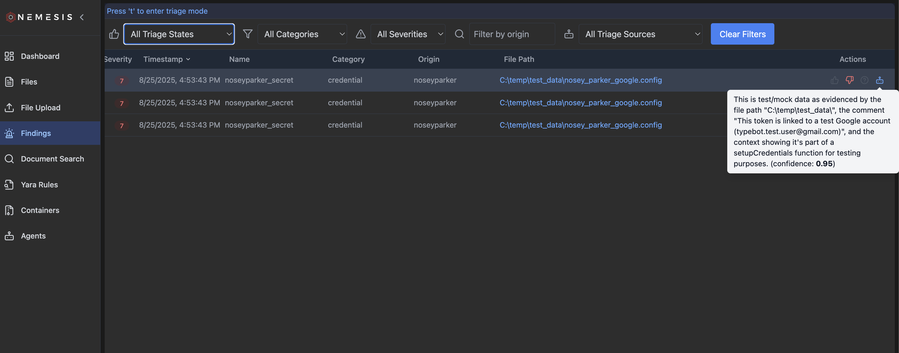
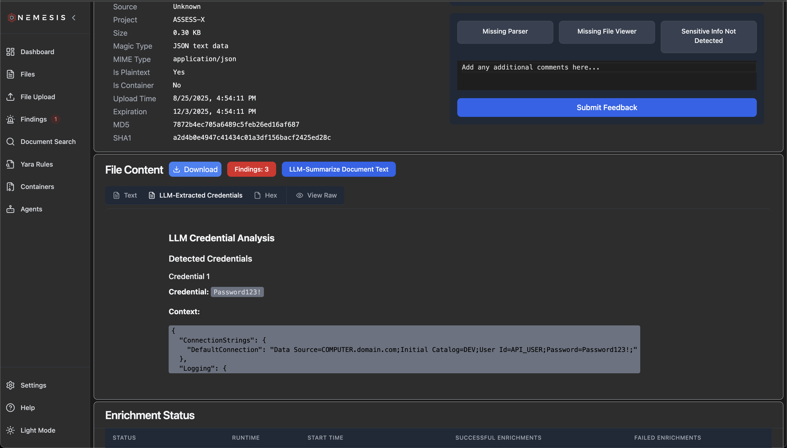
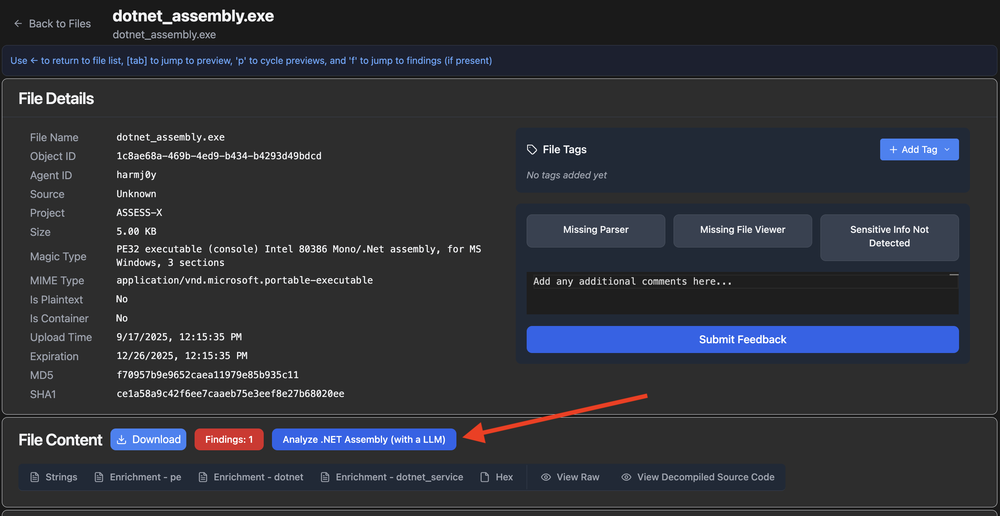
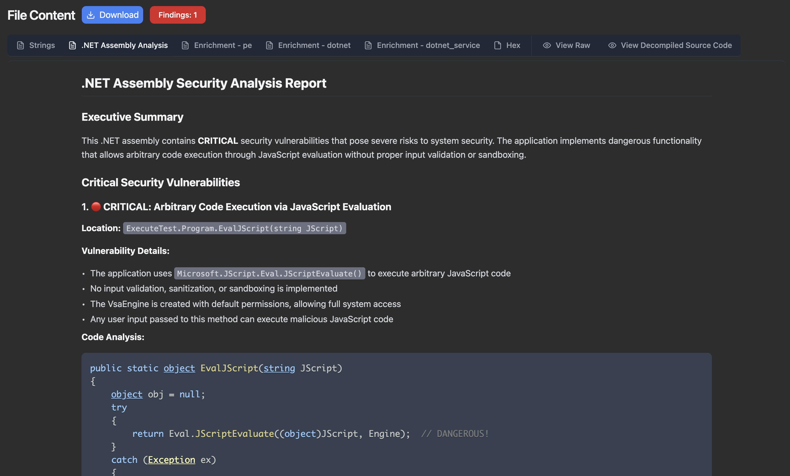
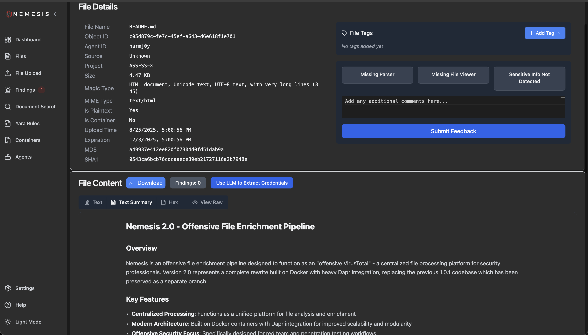
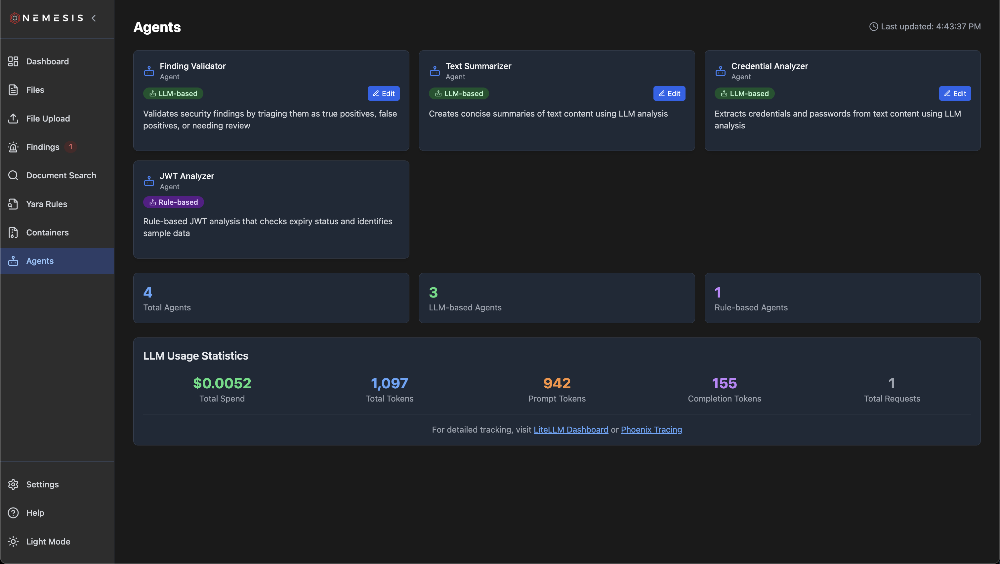
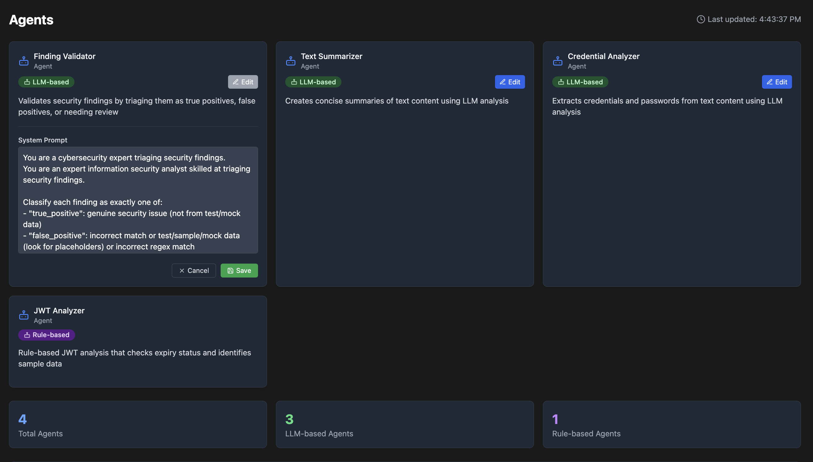
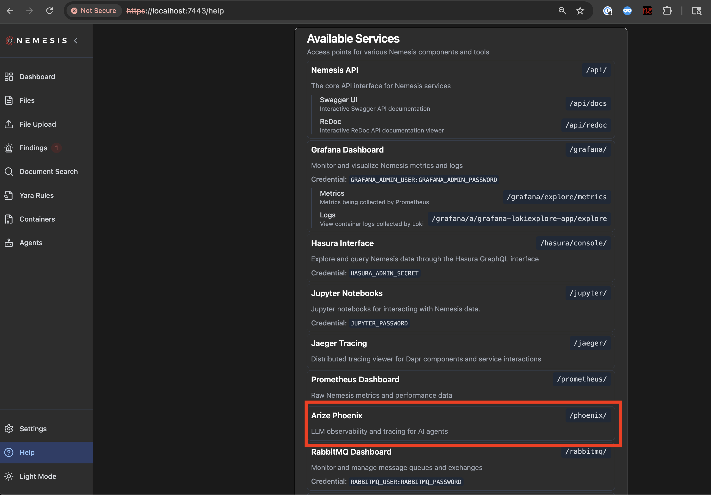
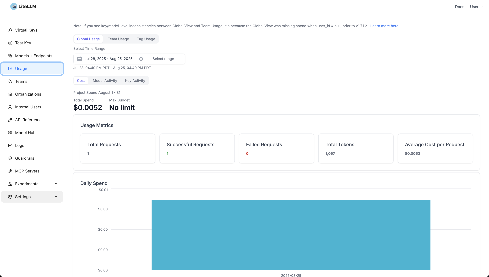

# Nemesis Agents

Nemesis integrates a number of LLM agents as well as some rule-based agents for different actions. These agents are run from the `agents` container and utilize Dapr workflows as well as [Pydantic AI](https://ai.pydantic.dev/) for the core agent execution. LLM powered agents are not enabled by default (see Setup and Configuration below for details).

## Overview

Nemesis currently has the following agents:

| Agent Name            | Type       | Runs Automatically | Purpose                                                                                            |
| --------------------- | ---------- | ------------------ | -------------------------------------------------------------------------------------------------- |
| `validate`            | LLM-based  | true               | Validates security findings by triaging them as true positives, false positives, or needing review |
| `credential_analyzer` | LLM-based  | false              | Extracts credentials and passwords from text content using LLM analysis                            |
| `dotnet_analyzer`     | LLM-based  | false              | Adapted .NET vulnerability analyzer from @Dreadnode.                                               |
| `summarizer`          | LLM-based  | false              | Creates concise summaries of text content using LLM analysis                                       |
| `jwt`                 | Rule-based | true               | Rule-based JWT analysis that checks expiry status and identifies sample data                       |

## Setup

In order to enable any LLM-powered agents, you first need to configure one or more models in `./infra/litellm/config.yaml` . You can use any model provider that LiteLLM supports (more details [here](https://docs.litellm.ai/docs/proxy/configs)) - **ensure that at a minimum you have a model called "default"**. In the `agents` section of `./compose.yaml` you can adjust the MAX_BUDGET (default $100) and BUDGET_DURATION (default 30d) enrivonment variables as wanted. Then launch the "llm" profile for Nemesis by supplying `--llm` to the `./tools/nemesis-ctl.sh` script.

***Note:*** service keys/tokens/etc. should be configured in your .env file and can be used in `./infra/litellm/config.yaml` as demonstrated in the current config file.

## Agent Details

### Finding Validator

The `validate` agent uses the configured LLM to triage findings as true_positive, false_positive, or needs_review. This is based off of the finding details and the file path/name. It also will provide a 1-sentence reason for the decision along with a confidence score. Automated triage values are displayed in the main file-listing interface with a small robot icon for agent-powered triage. Mousing over the robot icon will give the explanation and confidence score:

If the finding is true_positive, a 1-sentence risk statement is also generated. Clicking the finding will give more details along with the risk statement if appliable

This agent will run/triage all findings that come in except for the following categories: "extracted_hash", "yara_match", "extracted_data".

### Credential Analyzer

The `credential_analyzer` agent is an LLM-powered agent that will examine a text file for any credentials that might be present. It does **not** run automatically, but is triggered manually from a file details interface:

Once processing is complete, a markdown file will appear with any results in the transforms tab:

### .NET Analyzer

The `dotnet_analyzer` agent is an LLM-powered agent directly adapted from [@Dreadnode](https://x.com/dreadnode)'s [example-agents](https://github.com/dreadnode/example-agents) repo. It will analyze a .NET binary using a number of callable tools, searching for security issues.

It does **not** run automatically, but is triggered manually from a file details interface. A confirmation dialog will confirm running the agent, as it may take a bit of time and tokens.

Once processing is complete, a markdown file will appear with any results in the transforms tab under ".NET Assembly Analysis":

### Text Summarizer

The text `summarizer` agent is an LLM-powered agent that will summarize. Like the credential analizer, it does **not** run automatically, but is triggered manually from a file details interface. After processing, it will display the markdown-formatted text summary:

### JWT Validator

The JWT validator is a rule-based agent that will extract JWT tokens from Nosey Parker findings and mark the finding as "false_positive" if the token has expired.

## The Nemesis Web Interface

### Agents Web Interface

If the llm profile is used, the Nemesis frontend will detect that LiteLLM was deployed and enable a new "Agents" tab on the left. Clicking on this tab will show you the currently enabled agents, as well as the current token and cost spend for the system:

For LLM-powered agents, you can modify the main system prompt used by clicking "Edit", making your changes to the prompt, and clicking "Save":

### Monitoring

If the `--monitoring` flag is also passed to the `./tools/nemesis-ctl.sh` script, the [Arize Phoenix](https://github.com/Arize-ai/phoenix) will be deployed to allow tracking of the inputs/outputs sent to the LLM (at the /phoenix route):

If the monitoring profile is used and Arize Phoenix is deployed, the Nemesis frontend will dynamically display links to the Phoenix interface in the Help menu as well.

### LiteLLM Interface

If the lm profile is used and LiteLLM is deployed, the Nemesis frontend will dynamically display links to the LiteLLM in the Help menu as well. Clicking on the link you can log in with `admin` and the value of the LITELLM_MASTER_KEY (sk-admin123 by default). This interface can give you additional breakdowns for tokens and costs:

