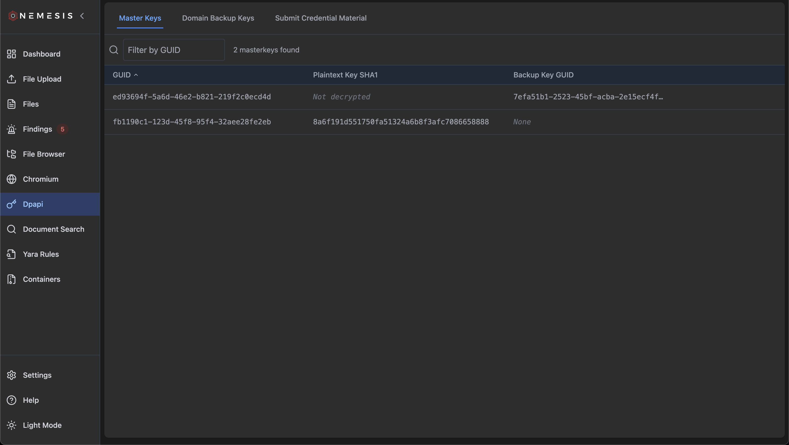
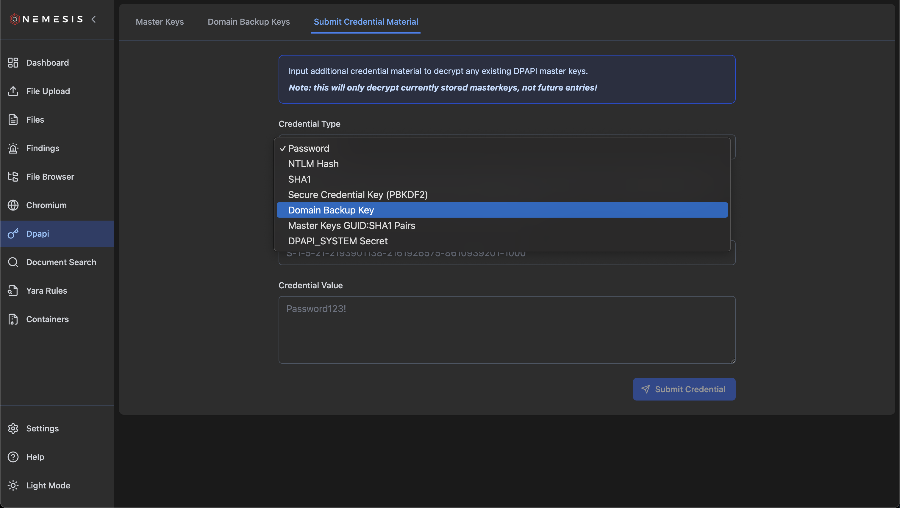

# Nemesis DPAPI Analysis

Nemesis includes comprehensive support for analyzing Microsoft's Data Protection API (DPAPI) artifacts, which are used to encrypt sensitive data on Windows systems.

The system provides functionality to view extracted DPAPI master keys, domain backup keys, and submit credential material to decrypt protected data.

Additionally, "retroactive" decryption will occur when plaintext DPAPI masterkeys are submitted (or scraped from LSASS dumps), or DPAPI masterkeys are successfully decrypted (via domain backup keys, NTLM hashes, passwords, etc.). Specifically, new plaintext masterkeys are used to decrypt Google Chromekey1's and Chromium Local State files.

## Overview

Nemesis currently analyzes and manages the following DPAPI data sources:

| Data Type                      | Purpose                                                                            |
| ------------------------------ | ---------------------------------------------------------------------------------- |
| Master Keys                    | User-specific DPAPI master keys used to encrypt/decrypt user data                  |
| Domain Backup Keys             | Domain controller backup keys for enterprise DPAPI key recovery                    |
| Credential Material Submission | Interface to submit various credential types to decrypt existing DPAPI master keys |

## DPAPI Web Tab

### DPAPI Data Viewer

The Nemesis frontend provides a dedicated DPAPI interface accessible through the main navigation. This interface organizes all DPAPI-related functionality into three main categories:

### Master Keys Tab

The Master Keys tab displays extracted DPAPI master keys with searchable and filterable tables. Each entry includes:

- **Object ID**: The object_id from the originating file
- **Source**: The "source" label for the originating file (host, url, etc.)
- **Username**: Host-based username, extracted from file path context (i.e., `C:\Users\USER\*`)
- **Key GUID**: Unique identifier for the master key
- **Key Status**: Decryption status of the master key
- **Created Date**: When the master key was created
- **Master Key Data**: The actual key material (if decrypted)

### Domain Backup Keys Tab

The Domain Backup Keys tab shows extracted domain backup keys used for enterprise DPAPI recovery:

- **Object ID**: The object_id from the originating file
- **Source**: The "source" label for the originating file (host, url, etc.)
- **Domain**: Domain name associated with the backup key
- **Key GUID**: Unique identifier for the backup key
- **Key Status**: Whether the backup key has been successfully extracted
- **Domain Controller**: Source domain controller (if available)
- **Backup Key Data**: The actual backup key material

### Submit Credential Material Tab

The Submit Credential Material tab provides an interface for submitting various types of credential material to decrypt existing DPAPI master keys stored in the system. This tab includes:

#### Credential Types Supported

The interface supports multiple credential types for DPAPI decryption:

- **Password**: Plain text passwords for user accounts
- **NTLM Hash**: NT hash values (16 bytes) for password-equivalent authentication
- **SHA1**: SHA1 credential keys (20 bytes) derived from NTLM hashes
- **Secure Credential Key (PBKDF2)**: 16-byte keys derived using PBKDF2
- **Domain Backup Key**: Domain controller DPAPI backup keys in base64 PVK format
- **Master Keys {GUID}:SHA1 Pairs**: Plaintext DPAPI master keys as {GUID}:SHA1 pairs
- **DPAPI_SYSTEM Secret**: System-wide DPAPI credentials for machine encryption

#### Form Fields

Based on the selected credential type, the form dynamically displays relevant fields:

- **User SID**: Required for user-specific credential types (password, NTLM hash, SHA1, PBKDF2)
- **Backup Key GUID**: Required for domain backup keys
- **Domain Controller**: Optional field for domain backup key submissions
- **Credential Value**: Main input field for the credential material
- **Master Key Data**: Structured input for {GUID}:SHA1 pairs (multi-line format)

Additionally, each credential type includes detailed descriptions explaining:

- What the credential type is used for
- How to obtain or generate the credential material
- Common sources where these credentials can be collected
- Technical details about the key format and length requirements

## Data Export and Analysis

### CSV Export Functionality

DPAPI data tables support CSV export for external analysis:

1. Use the table interface to filter and search desired records
2. Click the "Download CSV" button in the top-right of each tab
3. All currently visible/filtered records will be exported

### Copy Operations

Individual records or entire result sets can be copied to clipboard:

- **Single Row**: Double-click any table row to copy all fields
- **Multiple Rows**: Select rows and use Ctrl+C (or Cmd+C on Mac)
- **Filtered Results**: Copy button will copy all currently visible records

## Integration with Other Nemesis Components

### Automatic Processing

DPAPI artifacts are automatically processed when:

- Windows registry hives are uploaded (SYSTEM, SECURITY, SAM)
- LSASS dumps are analized
- User/system profile directories containing DPAPI folders/masterkeys are processed
